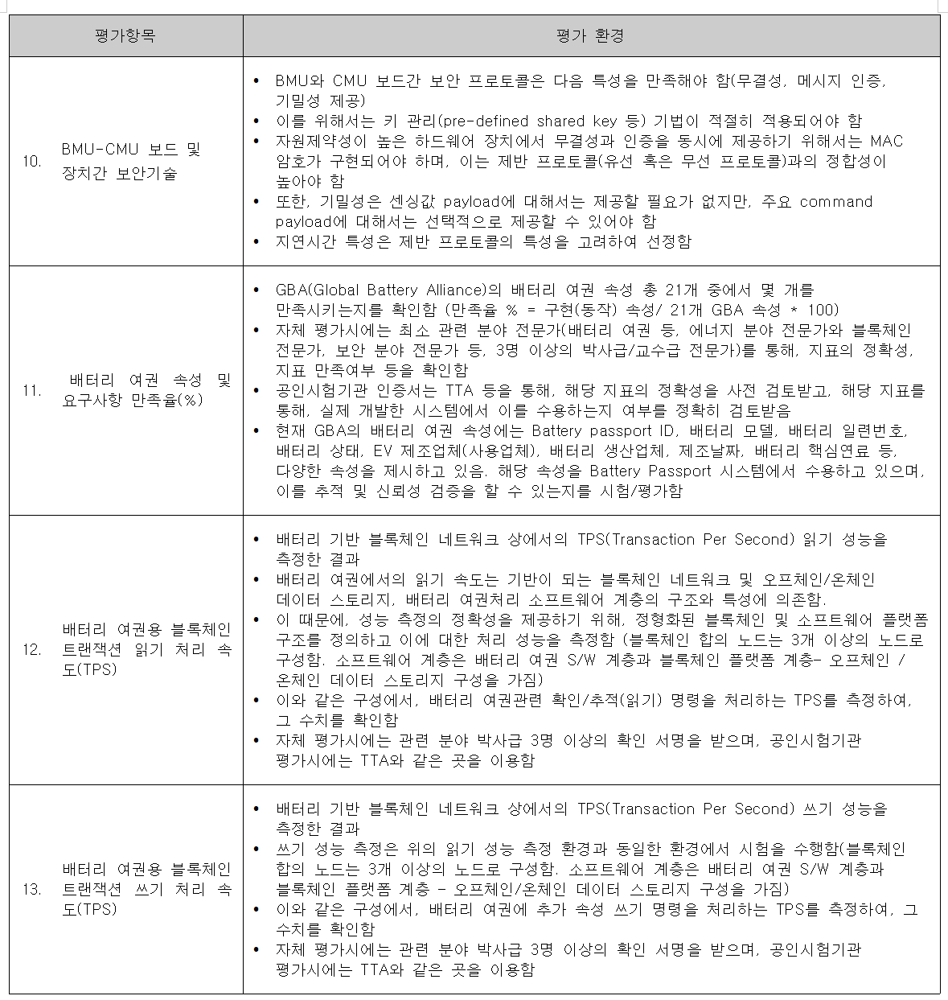
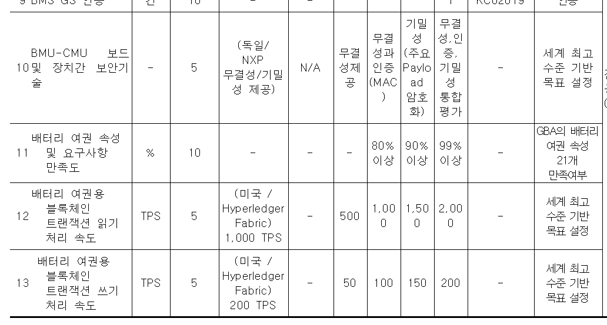

# 국가과제 KPI 목표 및 평가 기준

## 평가 기준 상세

## 연차별 목표

## 블록체인 관련 KPI 정리

| # | 평가항목 | 단위 | 1차 | 2차 | 3차 | 4차 | 비교 대상 |
|---|---------|------|-----|-----|-----|-----|----------|
| 11 | 배터리 여권 속성 만족도 | % | 80% | 90% | 99% | - | GBA 21개 항목 |
| 12 | 읽기 TPS | TPS | 500 | 1,000 | 1,500 | 2,000 | Fabric 1,000 TPS |
| 13 | 쓰기 TPS | TPS | 50 | 100 | 150 | 200 | Fabric 200 TPS |

## 현재 달성 현황 (3차년도)

| KPI | 목표 | 현재 | 상태 |
|-----|------|------|------|
| GBA 만족도 99% | 21/21 필드 | 21/21 (100%) | **달성** |
| 읽기 1,500 TPS | Caliper 또는 off-chain | 247 TPS (HTTP E2E) | **미달성 — 측정 방식 전환 필요** |
| 쓰기 150 TPS | Caliper direct | 20.5 TPS (HTTP E2E) | **미달성 — 환경/측정 전환 필요** |

## 측정 환경 요건 (평가 기준서 기준)

- 블록체인 노드 **3개 이상** 구성
- S/W 패키지 + 블록체인 플랫폼 계층 + **오프체인/데이터 스토리지** 구성
- 배터리 여권 관련 읽기/추적 명령 및 쓰기 명령으로 TPS 측정
- 자체 평가 + 관련 분야 박사급 3명 이상 검증 + **공인시험기관(TTA)**

## TPS 달성 전략

### 읽기 (1,500 → 2,000 TPS)
1. **오프체인 read model** (block event → PostgreSQL/Redis) — 평가 기준에서 허용
2. **Caliper direct evaluate** — SDK 직접 호출로 HTTP 오버헤드 제거
3. **multi-gateway peer 분산** — evaluate는 단일 peer 실행, 여러 peer로 라운드로빈
4. **peer gatewayService 동시성** 500 → 2000+

### 쓰기 (150 → 200 TPS)
1. **submitAsync** — commit 대기 없이 ordering 성공까지만 반환
2. **보증 정책 완화** — 고빈도 write (BMU 등)는 2-of-4 또는 1-of-4
3. **네이티브 Linux 환경** — WSL2 Docker 오버헤드 제거
4. **Caliper fixed-rate 측정** — 충분한 offered load 보장

### 측정 분리 전략
- **Blockchain layer KPI**: Caliper → Fabric raw TPS
- **Application layer KPI**: HTTP API E2E load test (k6/wrk)
- 두 수치 병기로 병목 설명 가능
